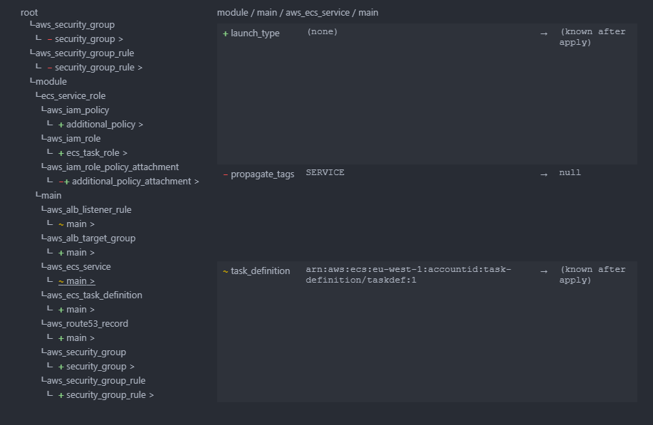

#  Terraform Graph

Visual representation of a Terraform plan, showing added, deleted and updated resources.

## Installing

This extension is available for free in the [Visual Studio Code Marketplace](https://marketplace.visualstudio.com/items?itemName=saramorillon.terraform-graph)

## Generate Terraform graph

You can generate a Terraform graph in three steps:

1. If you haven't done so already, install [Terraform](https://www.terraform.io/downloads)
2. Open command palette using <kbd>Ctrl+Shift+P</kbd>
3. Select command `Generate Terraform Graph`

This will open a terminal in your current working directory and run the following command:

```
terraform plan -out=plan && terraform show -json plan > plan.tfgraph
```

You can customize the command using the `terraform-graph.command` configuration option, e.g. in `.vscode/settings.json`:

```json
{
    "terraform-graph.command": "terraform plan -out=plan && terraform show -json plan > plan.tfgraph"
}
```

If a file is currently open in your editor, the command will be run in the directory of the file.

The command generates two files:

1. a Terraform plan file, which can be later applied using `terraform apply` command
2. a `.tfgraph` file (which is actually a simple json file)

## Visualize Terraform graph

You can visualize your terraform graph by simply opening the `.tfgraph` file in your editor.



On the left you can see all the resource changes. Red are the deleted resources, green the added ones and orange the updated ones.

When clicking on a resource, you can see on the left the properties that changed, with the same color mapping.

## Issues and improvement

For any issues or improvement, you can open an issue on the [github repository](https://github.com/saramorillon/terraform-graph/issues).
Any PR is welcome!
